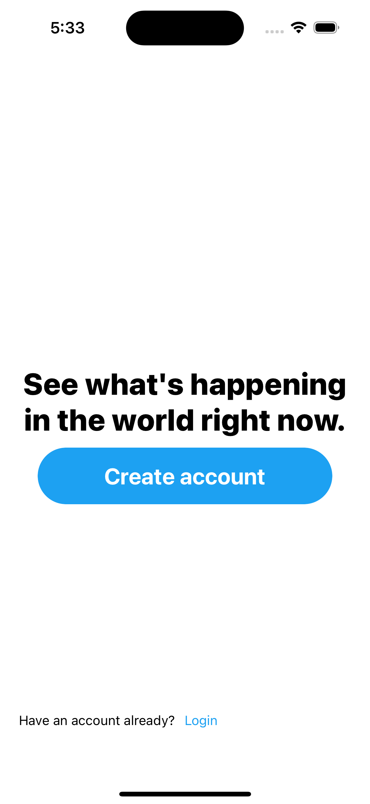
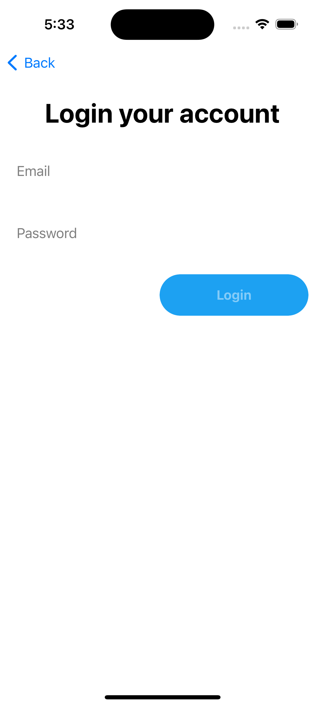
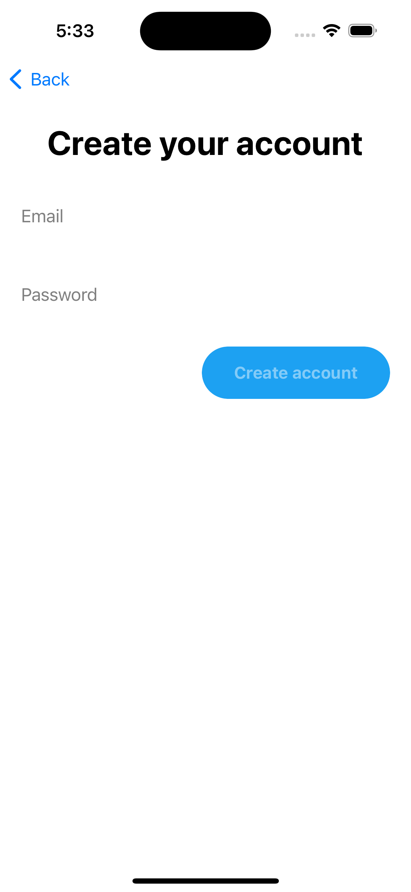
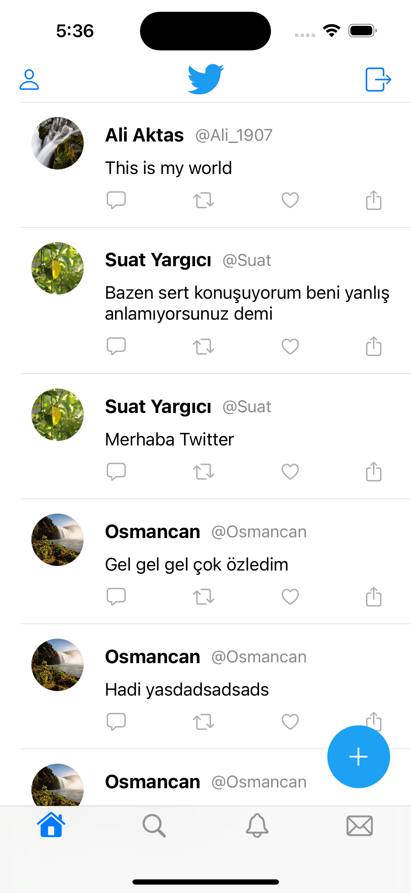
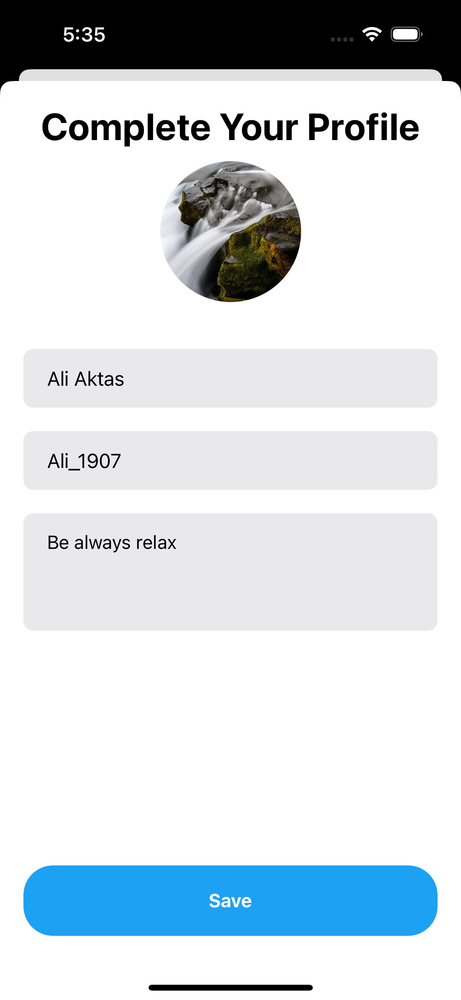
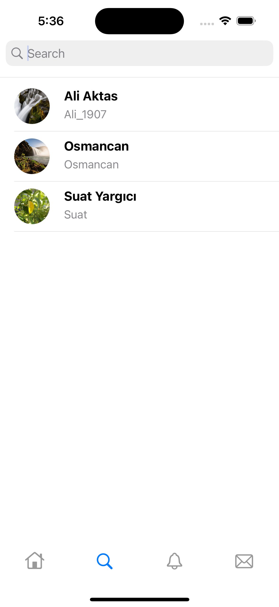
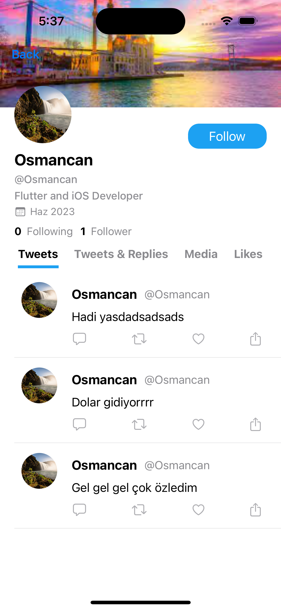
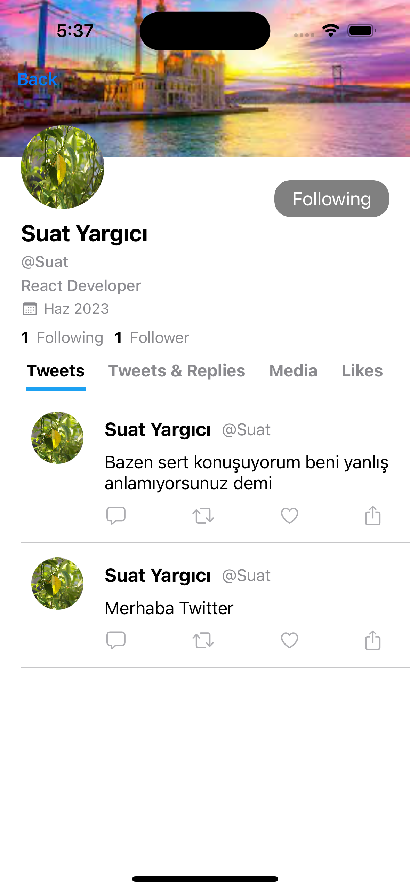
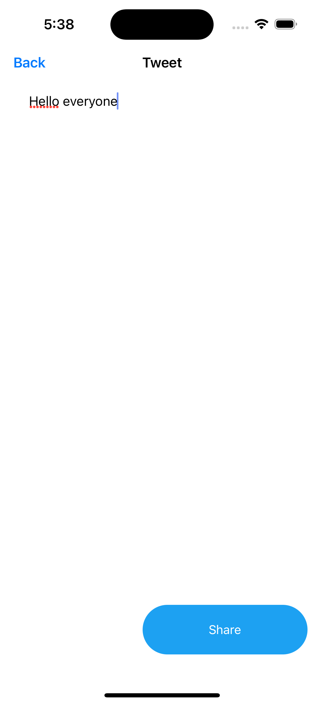

# Twitter Clone

This is a Twitter clone application developed using Swift technology. The application mimics the core functionalities of Twitter, allowing users to post tweets, follow others, view the main timeline, and edit their profile information.

## Technologies
- Swift
- XCode
- UIKit
- SDWebImage
- ProgressHUD
- Programmatic

# Screenshots 

  
  
  
  
  
  
  
  
  

## Installation

1. Clone this repository.
2. Run `pod install`.
3. Open `YummieApp.xcworkspace` in Xcode.
4. Run the project.

## Contributing

If you would like to contribute, please open an issue first and associate your changes with that issue.

## License

This project is licensed under the MIT License. See the `LICENSE` file for more information.

## Resources

Amr Youtube Channel
https://www.youtube.com/watch?v=lGDCGja79L8&list=PLqj8V2bxPxpAOhbAV10WmB4I6TUHKksN9

